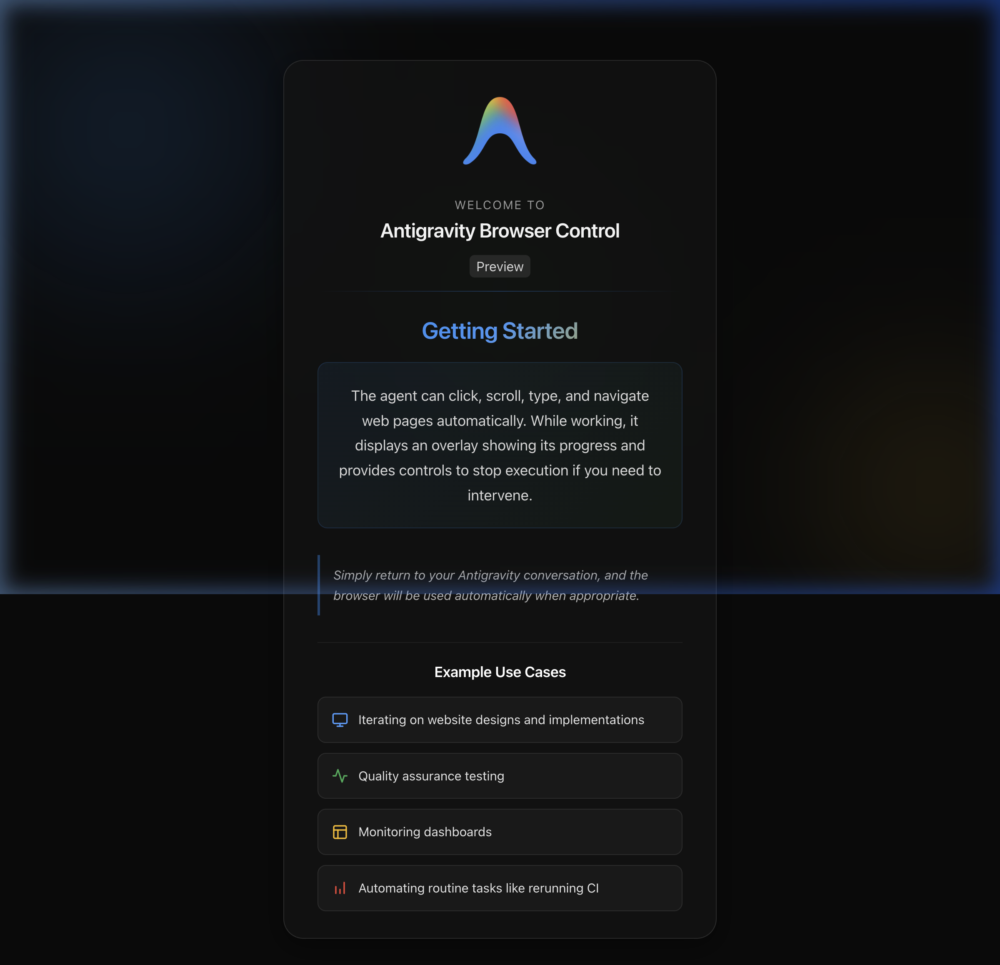
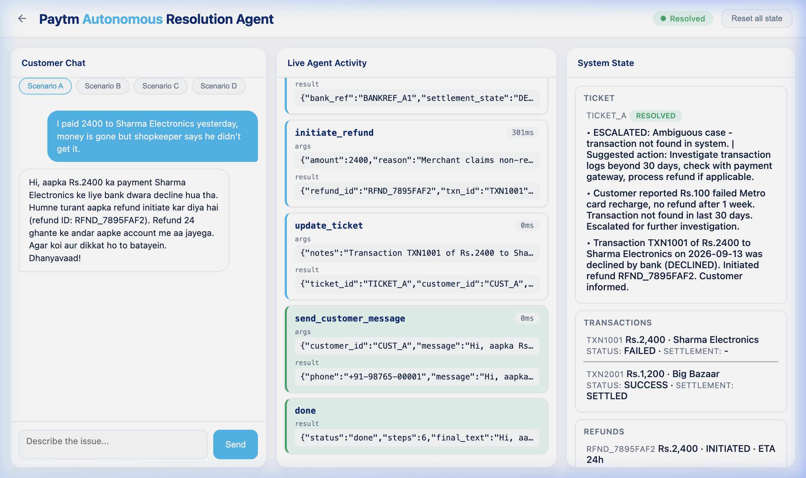
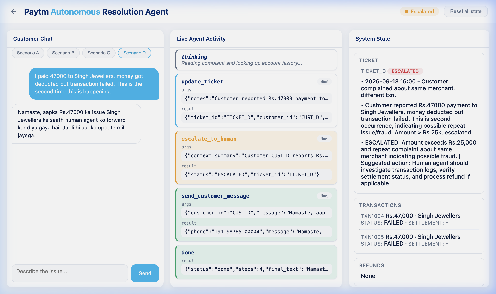

<![CDATA[<div align="center">

# 🏦 Paytm Autonomous Resolution Agent

**Autonomous refund resolution, not another chatbot.**

A hand-rolled AI agent that reads a customer complaint, investigates the transaction,
and takes action — refund, settlement, or escalation — in seconds.



</div>

---

## ✨ What It Does

| Traditional Chatbot | This Agent |
|---|---|
| Reads the complaint, matches a script | Parses amount, merchant, date, issue type |
| Asks the customer for details it already has | Looks up transactions and bank settlement itself |
| Cannot touch bank or refund systems | Executes refund, settlement, or escalation directly |
| Hands off to a human, 24–48h later | Resolves or escalates with full context in seconds |

---

## 🏗️ Architecture

```
┌─────────────────────────────────────────────────────────────┐
│                      Frontend (web/)                        │
│                                                             │
│  index.html  ──  styles.css  ──  app.js                     │
│                                                             │
│  • Landing page with feature highlights                     │
│  • Three-panel agent dashboard:                             │
│    ┌──────────────┬──────────────────┬─────────────────┐    │
│    │ Customer Chat│ Live Agent       │ System State    │    │
│    │              │ Activity         │                 │    │
│    │ Scenario     │ (tool calls,     │ Ticket, Txns,   │    │
│    │ A│B│C│D tabs │  args, results)  │ Refunds, SMS    │    │
│    └──────────────┴──────────────────┴─────────────────┘    │
└────────────────────────────┬────────────────────────────────┘
                             │  HTTP (polling /api/runs/:id/events)
                             ▼
┌─────────────────────────────────────────────────────────────┐
│                   FastAPI Server (api.py)                    │
│                                                             │
│  POST /api/run     → start agent run                        │
│  GET  /api/runs/:id/events?since=N  → poll events           │
│  POST /api/reset   → reset all mock state                   │
│  GET  /*           → serve static frontend                  │
└────────────────────────────┬────────────────────────────────┘
                             │
                             ▼
┌─────────────────────────────────────────────────────────────┐
│              Agent Loop (agent.py)                           │
│                                                             │
│  • System prompt with resolution decision tree              │
│  • OpenAI-compatible tool-calling loop (Groq API)           │
│  • Max 12 steps, auto-escalation on timeout                 │
│  • Streams events: tool_call → guardrail_block →            │
│    message_sent → escalation → done                         │
└────────────────────────────┬────────────────────────────────┘
                             │  function calls
                             ▼
┌─────────────────────────────────────────────────────────────┐
│              Tools & Guardrails (tools.py)                   │
│                                                             │
│  7 callable tools:                                          │
│  ┌─────────────────────────┐  ┌──────────────────────────┐  │
│  │ get_customer_transactions│  │ check_bank_settlement    │  │
│  │ initiate_refund          │  │ force_settlement         │  │
│  │ update_ticket            │  │ send_customer_message    │  │
│  │ escalate_to_human        │  │                          │  │
│  └─────────────────────────┘  └──────────────────────────┘  │
│                                                             │
│  Code-level guardrails:                                     │
│  ✗ Refund > ₹25,000 → BLOCKED → escalate                   │
│  ✗ Duplicate refund  → BLOCKED → escalate                   │
└────────────────────────────┬────────────────────────────────┘
                             │
                             ▼
┌─────────────────────────────────────────────────────────────┐
│                    Mock Backends                             │
│                                                             │
│  mock_txn_db.py     – In-memory transaction database        │
│  mock_bank_api.py   – Bank settlement status (with latency) │
│  mock_refund_api.py – Refund initiation & lookup            │
│  mock_crm.py        – CRM ticket management                 │
│  mock_notifier.py   – SMS outbox                            │
│  audit_log.py       – Immutable event trail                  │
└─────────────────────────────────────────────────────────────┘
```

---

## 🎬 Demo Scenarios

The agent ships with **4 seeded scenarios** that showcase different resolution paths:

### Scenario A — Auto-Refund
> *"I paid 2400 to Sharma Electronics yesterday, money is gone but shopkeeper says he didn't get it."*

The agent looks up the transaction → checks bank settlement (DECLINED) → initiates refund → updates CRM ticket → sends Hinglish SMS to customer. **Fully resolved autonomously.**



### Scenario B — Force Settlement
> *"I paid 5600 to Verma Mobile Store 3 days ago and the payment is still stuck."*

Transaction stuck in PENDING > 48h → agent force-settles → notifies customer.

### Scenario C — Proof of Payment
> *"I paid 850 to Gupta Kirana Store today, app shows it went through but I want confirmation."*

Already settled → agent sends proof-of-payment confirmation, no refund needed.

### Scenario D — Escalation (Guardrail Block)
> *"I paid 47000 to Singh Jewellers, money got deducted but transaction failed. This is the second time."*

Amount > ₹25,000 + repeat complaint → guardrail blocks auto-refund → agent escalates to human with full context.



---

## 📂 Project Structure

```
Paytm/
├── backend/                    # Python backend
│   ├── agent.py                # Core agent loop (tool-calling, streaming)
│   ├── api.py                  # FastAPI server (REST API + static hosting)
│   ├── tools.py                # Tool schemas, executor, guardrails
│   ├── main.py                 # CLI entrypoint (--scenario A|B|C|D)
│   ├── mock_txn_db.py          # Mock transaction database
│   ├── mock_bank_api.py        # Mock bank settlement API
│   ├── mock_refund_api.py      # Mock refund service
│   ├── mock_crm.py             # Mock CRM ticket system
│   ├── mock_notifier.py        # Mock SMS notifier
│   ├── audit_log.py            # Immutable audit trail
│   ├── reset_state.py          # State reset utility
│   └── seed_check.py           # Scenario validation
│
├── web/                        # Frontend (vanilla HTML/CSS/JS)
│   ├── index.html              # Landing page + agent dashboard
│   ├── styles.css              # Styling
│   └── app.js                  # Agent UI logic (polling, rendering)
│
├── .env.example                # Environment variable template
├── requirements.txt            # Python dependencies
└── README.md
```

---

## 🚀 Quick Start

### Prerequisites

- Python 3.11+
- A [Groq API key](https://console.groq.com/keys)

### 1. Clone & Install

```bash
git clone https://github.com/techbhuvi04/Payments.git
cd Payments
pip install -r requirements.txt
```

### 2. Configure Environment

```bash
cp .env.example .env
# Edit .env and add your Groq API key:
# GROQ_API_KEY=gsk_...
```

### 3. Run the Web UI

```bash
cd backend
uvicorn api:app --reload --port 8000
```

Open [http://localhost:8000](http://localhost:8000) in your browser.

### 4. Run via CLI (Optional)

```bash
cd backend
python main.py --scenario A   # Auto-refund
python main.py --scenario B   # Force settlement
python main.py --scenario C   # Proof of payment
python main.py --scenario D   # Escalation
```

---

## 🔧 How the Agent Works

```
Customer Complaint
        │
        ▼
┌─ Parse complaint (amount, merchant, date, issue type)
│
├─ get_customer_transactions() → find matching transaction
│
├─ check_bank_settlement() → get bank status
│
├─ Decision Tree:
│   ├── DECLINED + money debited → initiate_refund()
│   ├── PENDING > 48h           → force_settlement()
│   ├── SETTLED at merchant     → send proof (no refund)
│   └── Amount > ₹25K / fraud / ambiguous → escalate_to_human()
│
├─ send_customer_message() → Hinglish SMS
│
├─ update_ticket() → CRM status + notes
│
└─ Done (RESOLVED or ESCALATED)
```

### Guardrails (Code-Enforced, Not Prompt-Based)

| Rule | Enforcement |
|---|---|
| Refund amount > ₹25,000 | `GuardrailBlocked` exception → forced escalation |
| Duplicate refund for same txn | `GuardrailBlocked` exception → forced escalation |
| Agent exceeds 12 tool calls | Auto-escalation with context |

---

## 🛠️ Tech Stack

| Component | Technology |
|---|---|
| LLM | Groq API (OpenAI-compatible, `gpt-oss-120b`) |
| Backend | Python, FastAPI, Uvicorn |
| Frontend | Vanilla HTML, CSS, JavaScript |
| Agent Pattern | Hand-rolled tool-calling loop (no LangChain/framework) |
| Communication | Hinglish (Hindi + English, Roman script) |

---

## 📊 Key Features

- **🤖 7 System Tools** — Transactions, bank settlement, refunds, force-settlement, CRM, SMS, and escalation — all callable by the agent
- **🛡️ Code-Level Guardrails** — Refund limits and duplicate-refund checks enforced in code, not left to the model's judgment
- **⚖️ Calibrated Escalation** — High amounts, repeat complaints, or ambiguous cases are hedged to a human with full context
- **📝 Full Audit Trail** — Every tool call, guardrail block, and decision is logged in order, before the response is even generated
- **💬 Hinglish Responses** — Agent replies in natural Hinglish (Roman script), matching how real support agents communicate
- **⚡ Real-Time UI** — Three-panel dashboard shows customer chat, live agent activity, and system state updating in real-time

---

## 📄 License

This project is for demonstration and educational purposes.

---

<div align="center">
  <b>Built by <a href="https://github.com/techbhuvi04">techbhuvi04</a></b>
</div>
]]>