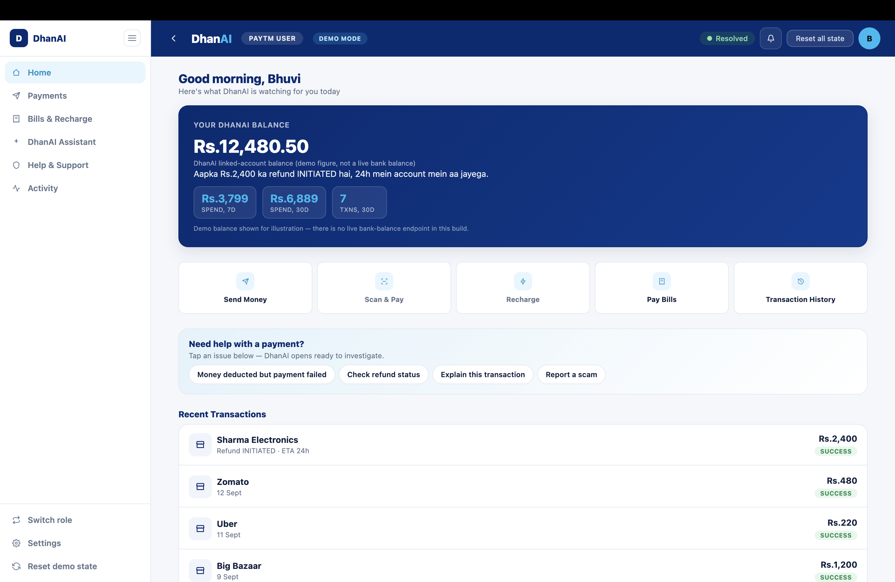
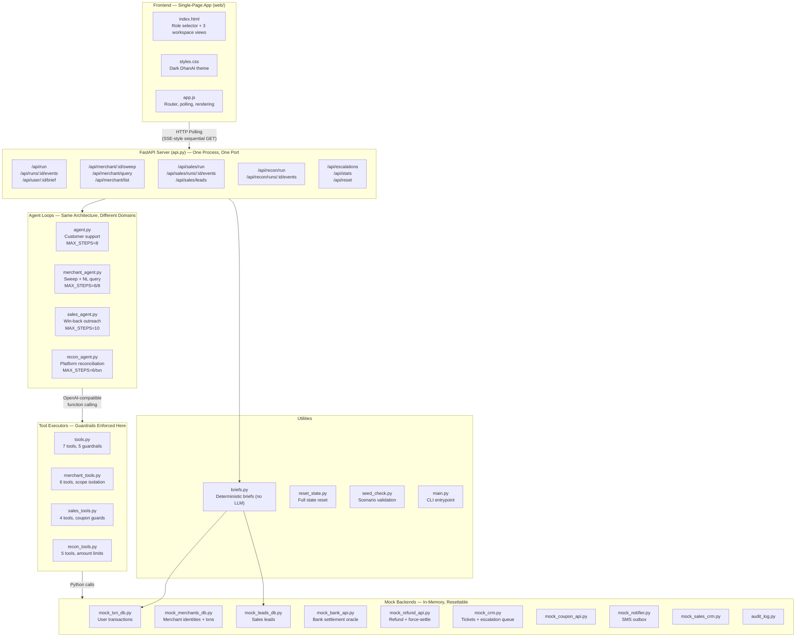
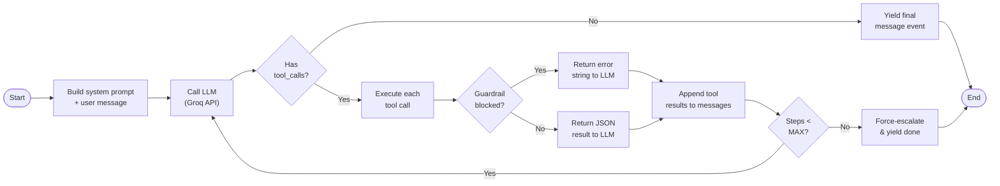
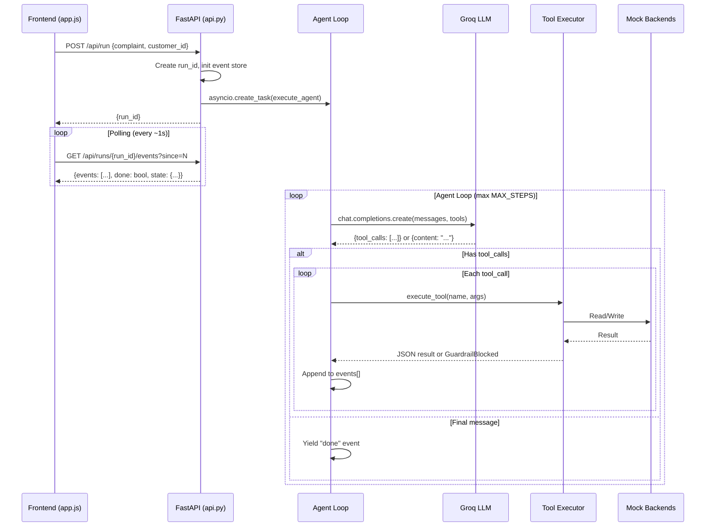
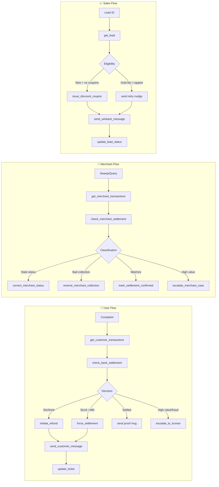
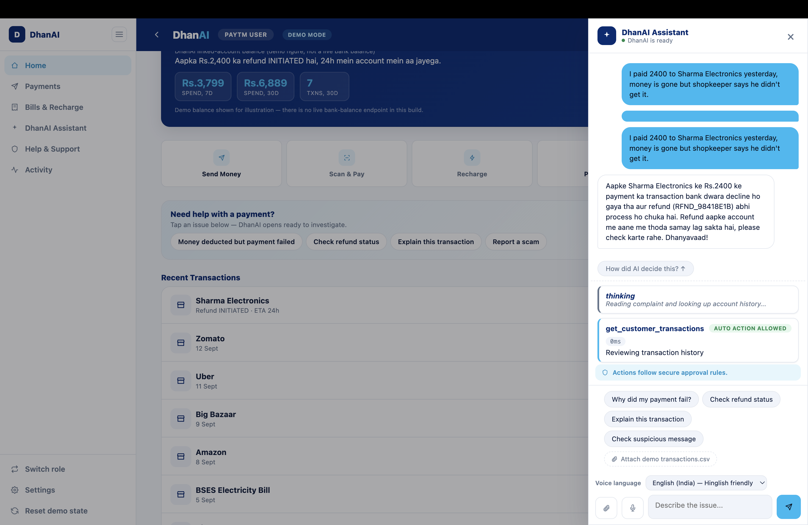
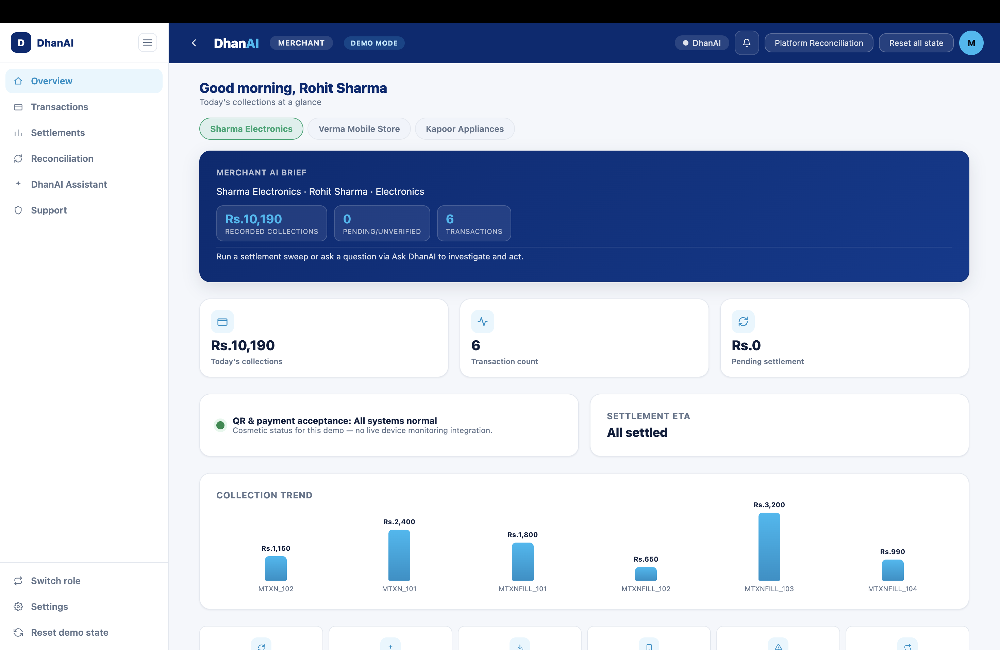
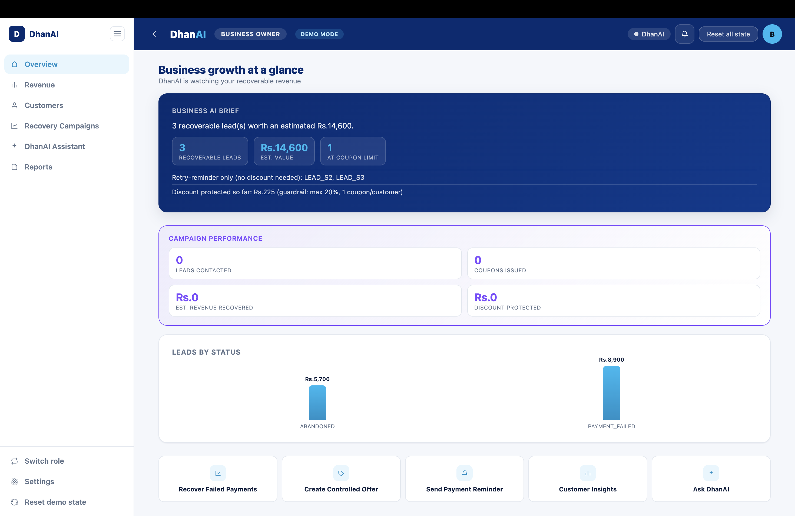

<div align="center">

# 🤖 DhanAI — Your Personalized Paytm Teammate

**One shared platform. Three role-based workspaces. Real actions, not just answers.**

A hand-rolled multi-agent system that reads context, decides, and acts — refunds, settlements,
coupons, escalations — end to end, instead of just chatting about them.



[](#prerequisites)
[](#tech-stack)
[](#tech-stack)
[](#license)

</div>

---

## Table of Contents

- [What It Does](#what-it-does)
- [System Architecture](#system-architecture)
  - [High-Level Architecture](#high-level-architecture)
  - [Agent Loop Architecture](#agent-loop-architecture)
  - [Request Lifecycle](#request-lifecycle)
  - [Data Flow by Role](#data-flow-by-role)
- [Core Design Principles](#core-design-principles)
- [Workspaces](#workspaces)
  - [A. Paytm User Workspace](#a-paytm-user-workspace)
  - [B. Merchant Workspace](#b-merchant-workspace)
  - [C. Business Owner Workspace](#c-business-owner-workspace)
- [Safety, Policy & Guardrail Matrix](#safety-policy--guardrail-matrix)
- [Human Escalation Queue](#human-escalation-queue)
- [API Reference](#api-reference)
- [Project Structure](#project-structure)
- [Tech Stack](#tech-stack)
- [Quick Start](#quick-start)
- [Demo Scenarios](#demo-scenarios)
- [60-Second Demo Script](#60-second-demo-script)
- [UI & Interaction Layer](#ui--interaction-layer)
- [License](#license)

---

## What It Does

DhanAI is a **multi-agent AI platform** built for Paytm's payment ecosystem. It doesn't just chat — it investigates, decides, and executes real financial operations (refunds, settlements, coupon issuance, escalations) through a hand-rolled tool-calling architecture, with every action guardrailed in Python code, not just prompt-engineered.

### Three Roles, One Platform

| Role | Workspace | What the Agent Does |
|---|---|---|
| **Paytm User** | Personal finance & payment support | Reads a complaint, investigates the transaction and bank settlement, resolves (refund / force-settle / proof-of-payment) or escalates — with a Decision Card explaining exactly why |
| **Merchant** | Collections & settlement operations | Proactively sweeps a merchant's own transactions for bank/internal mismatches, or answers a merchant's natural-language question about a specific settlement |
| **Business Owner** | Growth & revenue operations | Identifies recoverable checkout leads, runs guardrailed win-back outreach (coupon or plain nudge), and tracks revenue impact |

### Why Not Just Another Chatbot?

|  | Traditional Chatbot | DhanAI |
|:---:|---|---|
| | Reads the complaint, matches a script | Parses amount, merchant, date, issue type |
| | Asks for details it already has | Looks up transactions and bank settlement itself |
| | Cannot touch bank, refund, or coupon systems | Executes refund, settlement, coupon, or escalation directly |
| | Hands off to a human, 24–48h later | Resolves or escalates with full context in seconds, with an explainable Decision Card |

---

## System Architecture

### High-Level Architecture



### Agent Loop Architecture

Every agent in DhanAI follows the **same hand-rolled tool-calling loop pattern** — no LangChain, no framework, just a while-loop with explicit control flow:



**Key design decisions:**

| Decision | Rationale |
|---|---|
| **No framework** | Full control over retry logic, guardrail injection, and event shaping — no abstraction overhead |
| **Generator-based streaming** | `yield` events one at a time for real-time UI updates via polling |
| **Guardrails in Python, not prompts** | The LLM can hallucinate; `GuardrailBlocked` exceptions are unforgeable. Blocked tools return error strings to the LLM so it can adapt (e.g., escalate instead of retry) |
| **MAX_STEPS safety net** | Prevents infinite loops and runaway token spend — auto-escalates if hit |
| **First-turn nudge** | If the model emits an empty first response (Groq quirk), it's nudged to continue rather than failing silently |

### Request Lifecycle



### Data Flow by Role



---

## Core Design Principles

### 1. Guardrails in Code, Not Prompts

Every safety rule is enforced in the tool executor (`tools.py`, `merchant_tools.py`, `sales_tools.py`, `recon_tools.py`) as a `GuardrailBlocked` exception. The LLM is told about guardrails in its system prompt, but even if it ignores them, the Python layer blocks the action. The blocked error string is fed back to the LLM context so it can self-correct (e.g., escalate instead of retrying a blocked refund).

### 2. Merchant Data Isolation

In `merchant_tools.py`, every tool call receives the `scoped_merchant_id` the session was started with. Before any data is returned or any action is taken, the executor checks that the requested `merchant_id` or `mtxn_id` belongs to the scoped merchant. This is enforced in code — a merchant can never read or act on another merchant's records, regardless of what the LLM requests.

### 3. Deterministic Briefs (No LLM)

The User and Business Owner briefs (`briefs.py`) are computed with plain arithmetic and status checks over the mock databases. No LLM call, no hallucination risk, same input always produces the same brief. This keeps them fast, free, and auditable.

### 4. Idempotent Actions

Refunds, reversals, force-settlements, and status corrections are all idempotent — re-calling them on an already-processed transaction returns the existing result instead of creating a duplicate. This is critical for a system where the LLM might retry a tool call.

### 5. Unified Escalation Queue

All three workspaces feed into the same escalation queue in `mock_crm.py`. A merchant's settlement escalation and a customer's refund escalation land in one shared inbox, with structured context (reason, summary, suggested action, transaction records).

### 6. Explainable Decisions

The **Decision Card** (User workspace) and **Impact Card** (Business workspace) are built entirely from the run's own tool-call events — never fabricated. The UI renders what actually happened: which tools were called, what they returned, which guardrails fired, and what confidence level the outcome warrants.

---

## Workspaces

### A. Paytm User Workspace

> Personal finance & payment support · Built on `agent.py` / `tools.py`



**Dashboard:** Personal AI Brief · Customer support chat · Live AI activity · Payment/refund state · Recent transactions

**Personal AI Brief** (`GET /api/user/{customer_id}/brief`) is deterministic — no LLM call. It computes recent spend summary, any failed/pending payments needing attention, refund status, and a Hinglish reminder message.

**7 Available Tools:**

| Tool | Purpose | Guardrails |
|---|---|---|
| `get_customer_transactions` | Look up recent txns by customer_id | — |
| `check_bank_settlement` | Query bank settlement status by bank_ref | — |
| `initiate_refund` | Refund a failed transaction | Amount must match exactly; ≤Rs.25,000; no duplicates |
| `force_settlement` | Force-settle a stuck PENDING txn | Must be genuinely PENDING; must be >48h old |
| `update_ticket` | Update CRM ticket status/notes | Ticket must exist |
| `send_customer_message` | SMS the customer (Hinglish) | — |
| `escalate_to_human` | Hand off to human agent | Ticket must exist |

**Decision Card** — rendered after every resolution:
- **Decision** — the final action taken (refund / force-settle / escalation / no action)
- **Confidence** — high / medium / low, derived from guardrail interactions
- **Evidence** — actual tool calls and results, in order
- **Policy applied** — which guardrail fired, or that none did
- **Final message** — the Hinglish text sent to the customer

#### User Scenarios (A–G)

| Scenario | Customer | Amount | Path | Expected Outcome |
|---|---|---|---|---|
| **A** | CUST_A | ₹2,400 | Bank DECLINED, money debited | Auto-refund via `initiate_refund` |
| **B** | CUST_B | ₹5,600 | Stuck PENDING >48h (3 days) | `force_settlement` + customer notification |
| **C** | CUST_C | ₹850 | Already SETTLED at merchant | Proof of payment, no refund |
| **D** | CUST_D | ₹47,000 | >Rs.25K + repeat complaint signal | Guardrail blocks refund → `escalate_to_human` |
| **E** | CUST_E | ₹640 | Bank DECLINED, small amount | Auto-refund (different merchant/amount than A) |
| **F** | CUST_F | ₹3,200 | PENDING but only 10h old (<48h) | Too recent to force-settle → escalation |
| **G** | CUST_G | ₹31,000 | High value, single complaint | Escalation on amount alone (>Rs.25K) |

---

### B. Merchant Workspace

> Collections & settlement operations · Built on `merchant_agent.py` / `merchant_tools.py` + `mock_merchants_db.py`



**Dashboard:** Merchant AI Brief · Today's collections · Pending settlements · Sweep controls · Live agent activity · Exceptions/escalations

**Two operating modes:**

1. **Proactive Sweep** (`POST /api/merchant/{merchant_id}/sweep`)
   - Audits this merchant's own seeded transactions against the bank
   - Same classify-and-fix logic as platform reconciliation, but scoped to one merchant
   - Each transaction gets its own mini agent conversation (MAX_STEPS=6)

2. **Natural-Language Query** (`POST /api/merchant/query`)
   - Merchant types a question in Hinglish/English (e.g., *"Mujhe kal ke ₹5,600 payment ka settlement nahi mila."*)
   - Agent investigates only that merchant's records and takes the safe action

**6 Available Tools:**

| Tool | Purpose | Guardrails |
|---|---|---|
| `get_merchant_transactions` | Look up this merchant's recent txns | Merchant scope enforced |
| `check_merchant_settlement` | Query bank settlement for merchant bank_ref | — |
| `correct_merchant_status` | Fix stale internal status to match bank | Status must be valid; idempotent |
| `reverse_merchant_collection` | Reverse a bad collection | Amount must match; ≤Rs.10,000; no duplicates |
| `escalate_merchant_case` | Escalate to human queue | Ticket must exist |
| `mark_settlement_confirmed` | Record a clean match, no action needed | Merchant scope enforced |

#### Merchant Scenarios (3 merchants, one sweep scenario each)

| Merchant | ID | Scenario | Expected Outcome |
|---|---|---|---|
| **Sharma Electronics** | MERCH_1 | Both txns match bank (SETTLED ↔ SETTLED) | Clean confirmation via `mark_settlement_confirmed` |
| **Verma Mobile Store** | MERCH_2 | MTXN_201: internal PENDING, bank SETTLED; MTXN_202: COLLECTED but bank DECLINED (₹480) | Status corrected + small reversal auto-fixed |
| **Kapoor Appliances** | MERCH_3 | MTXN_301: COLLECTED but bank DECLINED with FRAUD hold (₹22,000) | Above Rs.10K → `escalate_merchant_case` |

---

### C. Business Owner Workspace

> Growth & revenue operations · Built on `sales_agent.py` / `sales_tools.py`



**Dashboard:** Business AI Brief · Recovery opportunities · Live agent activity · Coupon/outreach state · Revenue impact

**Business AI Brief** (`GET /api/business/{business_id}/brief`) is deterministic — no LLM call. Computed over the leads DB: recoverable leads count/value, retry-only leads, and coupon/discount protection stats.

**4 Available Tools:**

| Tool | Purpose | Guardrails |
|---|---|---|
| `get_lead` | Look up lead details (cart value, tier, coupon history) | Lead must exist |
| `issue_discount_coupon` | Issue a win-back discount coupon | ≤20% discount; max 1 coupon per customer |
| `send_winback_message` | SMS the customer (Hinglish) | — |
| `update_lead_status` | Update lead outreach status + notes | Lead must exist |

**Impact Card** — running session tally, built from confirmed tool results:
- Leads contacted
- Coupons issued
- Estimated revenue recovered
- Discount protected/saved by guardrails

#### Sales Scenarios (3 leads)

| Lead | Customer | Cart Value | Scenario | Expected Outcome |
|---|---|---|---|---|
| **LEAD_S1** | CUST_S1 (NEW tier) | ₹4,200 | Abandoned cart, no prior coupons | 10–15% coupon offered + Hinglish message |
| **LEAD_S2** | CUST_S2 (GOLD tier) | ₹8,900 | Payment failed (not abandoned) | Retry nudge only, no discount — customer already intended to buy |
| **LEAD_S3** | CUST_S3 (NEW tier) | ₹1,500 | Already at coupon limit (2 used) | Guardrail blocks coupon → plain retry nudge |

---

## Safety, Policy & Guardrail Matrix

All guardrails are enforced in **Python code** — a blocked tool call raises `GuardrailBlocked`, which the agent loop catches and feeds back to the LLM as a retryable tool error.

| # | Rule | Enforcement Location | Trigger Condition |
|---|---|---|---|
| 1 | Refund amount must **exactly match** transaction amount | `tools.py`, `recon_tools.py`, `merchant_tools.py` | `round(requested, 2) != round(actual, 2)` |
| 2 | User refund hard limit: **Rs.25,000** | `tools.py` | `amount > 25000` → escalate |
| 3 | Recon/Merchant auto-fix limit: **Rs.10,000** | `recon_tools.py`, `merchant_tools.py` | `amount > 10000` → escalate |
| 4 | **Duplicate refund/reversal** blocked | All tool executors | Existing refund found for same txn_id/mtxn_id |
| 5 | Force-settlement: must be **genuinely PENDING** | `tools.py` | `status != "PENDING"` → blocked |
| 6 | Force-settlement: must be **>48h old** | `tools.py` | `age < 48h` → blocked (escalate instead) |
| 7 | Force-settlement/status-correction is **idempotent** | `tools.py`, `merchant_tools.py`, `recon_tools.py` | Already in target state → safe no-op |
| 8 | **Hallucinated IDs** blocked | All tool executors | `txn_id`/`mtxn_id`/`ticket_id` not in DB |
| 9 | **Merchant data isolation** | `merchant_tools.py` | `txn.merchant_id != scoped_merchant_id` → blocked |
| 10 | Max win-back discount: **20%** | `sales_tools.py` | `discount_pct > 20` → blocked |
| 11 | Max **1 coupon per customer** | `sales_tools.py` | `prior_coupons_used >= 1` → blocked |
| 12 | Missing required tool arguments | All tool executors | Missing any `required` field → blocked with list of missing args |
| 13 | Agent **max steps** safety net | All agent loops | Auto-escalate after MAX_STEPS iterations |
| 14 | Hinglish communication | System prompts | All customer/merchant-facing messages in Roman-script Hinglish |

---

## Human Escalation Queue

Every escalation — from User, Merchant, or Reconciliation agent — lands in one shared **Human Inbox** via `mock_crm.py`:

```
POST /api/escalations/{ticket_id}/resolve  →  Closes the ticket with a resolution note
GET  /api/escalations                       →  All open escalated tickets, enriched with transaction data
```

Each escalation carries structured context:
- **Reason** — why the agent escalated
- **Context summary** — what was found during investigation
- **Suggested action** — the agent's recommendation for the human
- **Transaction records** — attached for reference

---

## API Reference

### User Workspace

| Method | Endpoint | Description |
|---|---|---|
| `POST` | `/api/run` | Start a customer support agent run. Body: `{complaint, customer_id, attachments?}` |
| `GET` | `/api/runs/{run_id}/events?since=N` | Poll events for a run (SSE-style) |
| `GET` | `/api/user/{customer_id}/brief` | Deterministic personal AI brief |

### Merchant Workspace

| Method | Endpoint | Description |
|---|---|---|
| `POST` | `/api/merchant/{merchant_id}/sweep` | Start a proactive settlement sweep |
| `GET` | `/api/merchant/sweep/{run_id}/events?since=N` | Poll sweep events |
| `POST` | `/api/merchant/query` | Start a natural-language query. Body: `{merchant_id, question, attachments?}` |
| `GET` | `/api/merchant/query/{run_id}/events?since=N` | Poll query events |
| `GET` | `/api/merchant/list` | List all seeded merchants |
| `GET` | `/api/merchant/{merchant_id}/state` | Current merchant snapshot (no agent run) |

### Sales / Business Owner Workspace

| Method | Endpoint | Description |
|---|---|---|
| `POST` | `/api/sales/run` | Start a win-back outreach run. Body: `{lead_id, customer_id, attachments?}` |
| `GET` | `/api/sales/runs/{run_id}/events?since=N` | Poll sales events |
| `GET` | `/api/sales/leads` | List all seeded leads |
| `GET` | `/api/business/{business_id}/brief` | Deterministic business AI brief |

### Reconciliation (Platform-Wide)

| Method | Endpoint | Description |
|---|---|---|
| `POST` | `/api/recon/run` | Start a platform reconciliation sweep (4 seeded txns) |
| `GET` | `/api/recon/runs/{run_id}/events?since=N` | Poll recon events |

### Shared

| Method | Endpoint | Description |
|---|---|---|
| `GET` | `/api/escalations` | All open escalated tickets |
| `POST` | `/api/escalations/{ticket_id}/resolve` | Resolve an escalation. Body: `{resolution_note}` |
| `GET` | `/api/stats` | Aggregate session stats (resolution rate, avg steps, guardrail blocks) |
| `POST` | `/api/reset` | Reset all mock state to original seed data |

### Event Schema (All Agents)

Every event emitted by any agent follows this schema:

```json
{
  "seq": 1,
  "type": "thinking | tool_call | guardrail_block | message_sent | escalation | txn_done | done",
  "tool": "tool_name or null",
  "args": { "...tool arguments..." },
  "result": "JSON string or summary",
  "latency_ms": 42,
  "blocked": false,
  "timestamp": "2026-09-14T12:00:00"
}
```

---

## Project Structure

```
Paytm/
├── backend/
│   │
│   │  ── Agent Loops ──────────────────────────────────────────────
│   ├── agent.py                # User workspace: customer support agent loop
│   ├── merchant_agent.py       # Merchant workspace: sweep + NL query agent loop
│   ├── sales_agent.py          # Business Owner workspace: win-back agent loop
│   ├── recon_agent.py          # Platform-wide proactive reconciliation sweep
│   │
│   │  ── Tool Executors (guardrails enforced here) ────────────────
│   ├── tools.py                # Support tool schemas, executor, 5 guardrails
│   ├── merchant_tools.py       # Merchant tool schemas, executor, scope isolation
│   ├── sales_tools.py          # Sales tool schemas, executor, coupon guardrails
│   ├── recon_tools.py          # Reconciliation tool schemas, executor
│   │
│   │  ── API & Utilities ──────────────────────────────────────────
│   ├── api.py                  # FastAPI server (all REST endpoints + static hosting)
│   ├── briefs.py               # Deterministic User/Business AI Brief (no LLM)
│   ├── main.py                 # CLI entrypoint (--scenario A..G)
│   ├── reset_state.py          # Resets all mock state across all roles
│   ├── seed_check.py           # Scenario validation
│   ├── audit_log.py            # Immutable audit trail
│   │
│   │  ── Mock Backends (in-memory, resettable) ────────────────────
│   ├── mock_txn_db.py          # User transactions (7 scenarios + 4 recon + filler)
│   ├── mock_merchants_db.py    # Merchant identities + merchant-side transactions
│   ├── mock_leads_db.py        # Sales leads (abandoned/failed checkouts)
│   ├── mock_bank_api.py        # Bank settlement oracle (user-side)
│   ├── mock_refund_api.py      # Refund/force-settlement service
│   ├── mock_coupon_api.py      # Coupon issuance
│   ├── mock_crm.py             # Tickets + shared human escalation queue
│   ├── mock_sales_crm.py       # Lead outreach status
│   └── mock_notifier.py        # SMS outbox
│
├── web/
│   ├── index.html              # Role selector + all three workspace views (57K)
│   ├── styles.css              # Dark DhanAI theme (68K)
│   └── app.js                  # Router, agent polling, briefs, Decision/Impact Cards (107K)
│
├── docs/images/                # Screenshots
├── .env.example                # GROQ_API_KEY template
├── requirements.txt            # openai, python-dotenv, fastapi, uvicorn
├── runtime.txt                 # python-3.11.9 (Heroku runtime)
├── Procfile                    # Heroku process definition
└── README.md
```

**Codebase:** ~7,750 lines across 23 Python files + 3 frontend files. Zero external AI frameworks.

---

## Tech Stack

| Layer | Technology | Why |
|---|---|---|
| **LLM** | Groq API (OpenAI-compatible, `gpt-oss-120b`) | Fast inference, function calling support, free tier |
| **Backend** | Python 3.11, FastAPI, Uvicorn | Async task execution, auto-generated API docs |
| **Frontend** | Vanilla HTML/CSS/JS (no build step, no framework) | Zero dependencies, instant load, full control |
| **Agent Pattern** | Hand-rolled tool-calling loop | No LangChain/LlamaIndex — explicit control over every step |
| **Briefs** | Deterministic, rule-based (plain Python) | No LLM = no hallucination, instant, free |
| **Communication** | Hinglish (Hindi + English, Roman script) | Natural for Indian users, enforced in system prompts |
| **Deployment** | Heroku (Procfile + runtime.txt) | One-command deploy, static files served by FastAPI |

---

## Quick Start

### Prerequisites

- Python 3.11+
- A [Groq API key](https://console.groq.com/keys)

### 1. Clone & Install

```bash
git clone https://github.com/techbhuvi04/Payments.git
cd Payments
pip install -r requirements.txt
```

### 2. Configure Environment

```bash
cp .env.example .env
# Edit .env and add your Groq API key:
# GROQ_API_KEY=gsk_...
```

### 3. Run the Web UI

```bash
cd backend
uvicorn api:app --reload --port 8000
```

Open [http://localhost:8000](http://localhost:8000) — you'll land on the role selector.

### 4. Run via CLI (User workspace scenarios only)

```bash
cd backend
python main.py --scenario A   # Auto-refund
python main.py --scenario D   # Escalation
# ... A through G
```

---

## Demo Scenarios

### Complete Scenario Matrix

| # | Role | ID | Scenario | Type | Key Guardrails Tested |
|---|---|---|---|---|---|
| 1 | User | A | Auto-refund (₹2,400) | ✅ Success | Exact amount match |
| 2 | User | B | Force settlement (₹5,600, 3d pending) | ✅ Success | >48h age check |
| 3 | User | C | Proof of payment (₹850) | ✅ Success | Already settled detection |
| 4 | User | D | High-value + repeat complaint (₹47,000) | 🚨 Escalation | Rs.25K limit + fraud signal |
| 5 | User | E | Small clean refund (₹640) | ✅ Success | Exact amount match |
| 6 | User | F | Pending but <48h (₹3,200, 10h) | 🚨 Escalation | <48h age block |
| 7 | User | G | High value, single complaint (₹31,000) | 🚨 Escalation | Rs.25K limit alone |
| 8 | Merchant | MERCH_1 | Clean confirmation (2 txns) | ✅ Success | — |
| 9 | Merchant | MERCH_2 | Safe auto-fixes (stale status + small reversal) | ✅ Success | Rs.10K limit, amount match |
| 10 | Merchant | MERCH_3 | High-value fraud-flagged mismatch (₹22,000) | 🚨 Escalation | Rs.10K limit |
| 11 | Merchant | — | Natural-language query (Hinglish) | ✅ Success | Merchant scope isolation |
| 12 | Sales | S1 | New customer, abandoned cart (₹4,200) | 🎫 Coupon | — |
| 13 | Sales | S2 | GOLD tier, payment failed (₹8,900) | 📩 Nudge | No unnecessary discount |
| 14 | Sales | S3 | Already at coupon limit (₹1,500) | 📩 Nudge | Max coupons per customer |
| 15 | Platform | — | Reconciliation sweep (4 txns: match/fix/escalate/match) | Mixed | All recon guardrails |

---

## 60-Second Demo Script

1. **Land on the role selector.** Point out this is one shared platform: three role cards (Paytm User, Merchant, Business Owner), not three separate apps.

2. **Open Paytm User.** Show the Personal AI Brief loading instantly (no LLM call — deterministic). Click Scenario D (high-value + repeat complaint). Watch the live activity feed, then the **Decision Card** — point out it's built from the actual tool results, with a confidence level and the exact guardrail that fired.

3. **Back to role selection → open Merchant.** Pick Kapoor Appliances, run the settlement sweep. Show it catching a high-value bank/internal mismatch and escalating it — before any customer complained.

4. **Open Human Inbox** (visible from every workspace) — show the merchant's escalation sitting next to a customer escalation, one shared queue.

5. **Back to role selection → open Business Owner.** Run outreach on a GOLD-tier lead — show it sends a retry nudge with **no coupon**, and the Impact Card updates. Point out the coupon guardrail: this customer keeps their margin protected.

6. **Close on the safety story:** exact-amount-match refunds, 48h force-settlement guard, idempotent actions, merchant data isolation — all enforced in code, shown live via the guardrail-block cards in the activity feed, not just claimed in a slide.

---

## UI & Interaction Layer

The frontend is a single-page, mobile-first app shell (vanilla HTML/CSS/JS, no build step, no framework) shared across all three role workspaces:

- **App shell** — sticky top header (brand, role badge, notification bell, avatar, demo-mode indicator), a collapsible left sidebar on desktop (~248px expanded / ~72px collapsed, role-specific nav items, switch-role/settings/reset-demo-state at the bottom), and a 5-tab bottom nav on mobile (Home, Activity, a center "Ask DhanAI" button, Insights, Profile). The sidebar hides entirely below ~768px in favor of the bottom nav.

- **DhanAI Assistant drawer** — the chat/explainability overlay, a right-side drawer on desktop (~400px) and a bottom sheet on mobile, with `Escape`-to-close, an agent status indicator ("DhanAI is ready" / "DhanAI is working..."), role-specific suggested prompt chips, and a visible "Actions follow secure approval rules" note.

- **Voice input** — mic button in the composer uses the Web Speech API (`SpeechRecognition`/`webkitSpeechRecognition`) with live interim transcription, elapsed-time timer, language selector (English (India) or Hindi (India)), and a graceful non-blocking fallback on unsupported browsers. Never auto-sends — transcript populates the composer for review.

- **File attachments** — paperclip button + drag-and-drop, accepts PNG/JPG/WEBP/PDF/TXT/CSV/JSON up to 5 files / 10 MB each. Text-like files (TXT/CSV/JSON) are read client-side and a truncated preview (2000 chars) is included in the agent's context. PDF/image attachments send metadata only — no OCR.

- **Autonomy meter** — UI framing layer that labels each live tool-call step as "Auto action allowed" (low risk), "User confirmation required" (medium risk), or "Human escalation required". This is a UI label — real guardrails remain server-side in the tool executors.

- **Readable agent activity** — raw tool names are translated into plain-language steps (e.g., `check_bank_settlement` → "Checking bank settlement"); expandable "How did AI decide this?" toggle shows raw tool name/args/JSON result underneath.

- **Dashboard components** — stat cards, status pills, transaction rows, hand-rolled CSS/SVG bar charts (no charting library), loading skeletons, empty states, toasts, and a confirmation modal for quick actions that trigger agent runs.

---

## License

This project is for demonstration and educational purposes.

---

<div align="center">
  <b>Built by <a href="https://github.com/techbhuvi04">techbhuvi04</a></b>
</div>
