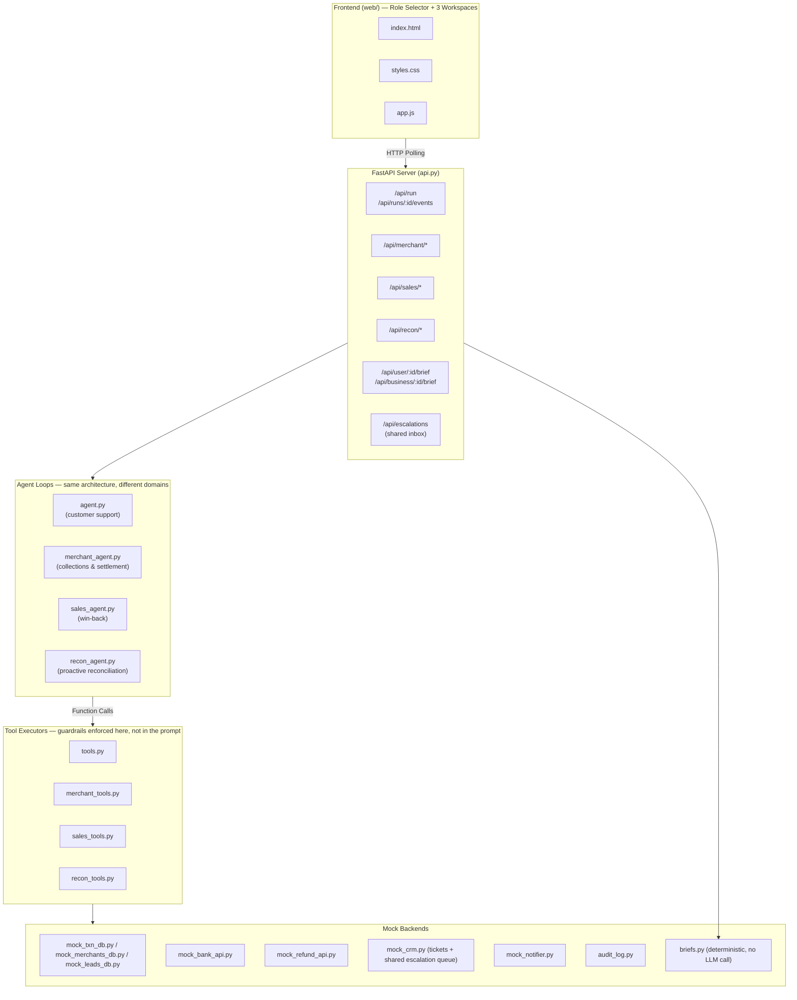

<div align="center">

# DhanAI — Your Personalized Paytm Teammate

**One shared platform. Three role-based workspaces. Real actions, not just answers.**

A hand-rolled multi-agent system that reads context, decides, and acts — refunds, settlements,
coupons, escalations — end to end, instead of just chatting about them.


</div>

---

## What It Does

DhanAI is one platform with three role-based workspaces, all built on the same
tool-calling architecture, sharing the same guardrail patterns, audit log, and human
escalation queue:

| Role | Workspace | What the agent does |
|---|---|---|
| **Paytm User** | Personal finance & payment support | Reads a complaint, investigates the transaction and bank settlement, resolves (refund / force-settle / proof-of-payment) or escalates — with a Decision Card explaining exactly why |
| **Merchant** | Collections & settlement operations | Proactively sweeps a merchant's own transactions for bank/internal mismatches, or answers a merchant's own natural-language question about a specific settlement |
| **Business Owner** | Growth & revenue operations | Proactively identifies recoverable checkout leads, runs guardrailed win-back outreach (coupon or plain nudge), and tracks revenue impact |

| | Traditional Chatbot | DhanAI |
|:---:|---|---|
| | Reads the complaint, matches a script | Parses amount, merchant, date, issue type |
| | Asks for details it already has | Looks up transactions and bank settlement itself |
| | Cannot touch bank, refund, or coupon systems | Executes refund, settlement, coupon, or escalation directly |
| | Hands off to a human, 24–48h later | Resolves or escalates with full context in seconds, with an explainable Decision Card |

---

## Architecture



### One Shared Platform, Not Three Demos

- All three workspaces are views inside the **same single-page app**, routed through a
  role selector landing page. Every workspace has a "back to role selection" action.
- All three agent domains share the same **hand-rolled tool-calling loop pattern**, the
  same **audit log**, and the same **human escalation queue** — a merchant's escalated
  settlement issue and a customer's escalated refund both land in one inbox.
- Guardrails are enforced in **Python code**, not the system prompt, across every domain.

---

## A. Paytm User Workspace

Personal finance & payment support, built on `agent.py` / `tools.py`.

**Dashboard:** Personal AI Brief · Customer support chat · Live AI activity · Payment/refund state · Recent transactions

**Personal AI Brief** (`GET /api/user/{customer_id}/brief`) is **deterministic — no LLM call**.
It's computed with plain arithmetic and status checks over the mock transaction DB:
recent spend summary, any failed/pending payment needing attention, refund status, and a
short proactive Hinglish reminder message.

**Decision Card** — after every resolution, the UI renders an explainability card built
entirely from the run's own tool-call events (never fabricated):
- **Decision** — the final action taken (refund / force-settlement / escalation / no action)
- **Confidence** — high / medium / low, derived from whether the run hit guardrail
  pushback or an escalation, not a guessed number
- **Evidence** — the actual tool calls and their results, in order
- **Policy applied** — which guardrail fired, or that none did
- **Final message** — the exact Hinglish text sent to the customer

### Demo Scenarios A–G (preserved, unchanged behavior)

| Scenario | Path | Outcome |
|---|---|---|
| **A** | Bank declined, money debited | Auto-refund |
| **B** | Stuck > 48h in PENDING | Force-settlement |
| **C** | Already settled at merchant | Proof of payment, no refund |
| **D** | > Rs.25,000 + repeat complaint | Guardrail blocks refund → escalation |
| **E** | Small clean refund | Auto-refund (different merchant/amount than A) |
| **F** | Pending but < 48h old | Too recent to force-settle → escalation |
| **G** | High value, single complaint | Escalation on amount alone |

---

## B. Merchant Workspace

Collections & settlement operations, built on `merchant_agent.py` / `merchant_tools.py`
(reusing `recon_agent.py`'s proactive-sweep pattern as its foundation) and
`mock_merchants_db.py`.

**Dashboard:** Merchant AI Brief · Today's collections · Pending settlements · Sweep controls · Live agent activity · Exceptions/escalations

**Two ways to work a merchant's transactions:**
1. **Proactive sweep** (`POST /api/merchant/{merchant_id}/sweep`) — audits the merchant's
   own seeded transactions against the bank, same classify-and-fix logic as the platform
   reconciliation sweep, but strictly scoped to one merchant.
2. **Natural-language query** (`POST /api/merchant/query`) — a merchant can type something
   like *"Mujhe kal ke ₹5,600 payment ka settlement nahi mila."* and the agent investigates
   only that merchant's own records and takes the correct safe action.

**Merchant scope isolation** is enforced in `merchant_tools.py`'s executor, independent of
the LLM: every tool call is checked against the `merchant_id` the session was started
with. A merchant can never read or act on another merchant's transactions, even if the
LLM is fed or hallucinates a different merchant's ID — the check happens in code before
any data is returned.

### Demo Scenarios (3 merchants, one seeded sweep scenario each)

| Merchant | Scenario | Outcome |
|---|---|---|
| **MERCH_1** — Sharma Electronics | Clean settlement confirmation | Both transactions match, no action needed |
| **MERCH_2** — Verma Mobile Store | Safe stale-status correction + safe low-value mismatch | Internal status corrected; small bad collection reversed |
| **MERCH_3** — Kapoor Appliances | High-value, fraud-flagged mismatch | Escalated to human (above the Rs.10,000 auto-fix limit) |

The platform-wide reconciliation sweep (all seeded transactions, any merchant) remains
available from the Merchant workspace as "Platform Reconciliation."

---

## C. Business Owner Workspace

Growth & revenue operations, built on the existing `sales_agent.py` / `sales_tools.py`.

**Dashboard:** Business AI Brief · Recovery opportunities (failed checkout leads) · Live agent activity · Coupon/outreach state · Revenue impact

**Business AI Brief** (`GET /api/business/{business_id}/brief`) is **deterministic — no
LLM call**. It's computed over the mock leads DB: number/value of recoverable leads,
which leads should get only a retry reminder (already high-tier or already coupon-capped),
and a coupon/discount protection summary.

**Impact Card** — a running tally for the session, built only from confirmed tool
results (a coupon actually issued, a message actually sent):
- Leads contacted
- Coupons issued
- Estimated revenue recovered
- Discount protected/saved by the guardrails

**Win-back guardrails (unchanged, enforced in code):**
- A coupon is only offered to eligible, first-coupon customers
- No second coupon for a customer already at the limit — plain retry nudge instead
- No discount above the enforced cap (20%)
- Every outreach updates lead status and sends a Hinglish message

---

## Safety, Policy & Data Rules

All guardrails below are enforced in **Python code** (`tools.py`, `recon_tools.py`,
`merchant_tools.py`, `sales_tools.py`) — a blocked tool call raises `GuardrailBlocked`,
which the agent loop catches and feeds back to the LLM as a retryable tool error. None of
this depends on the system prompt alone.

| Rule | Where |
|---|---|
| Refund amount must **exactly match** the transaction's actual amount | `tools.py`, `recon_tools.py`, `merchant_tools.py` |
| Refund/reversal above the auto-fix limit (Rs.25,000 support / Rs.10,000 recon & merchant) | escalate instead of auto-resolving |
| Duplicate refund/reversal for the same transaction | blocked, returns existing record |
| **Force-settlement blocked unless the transaction is genuinely `PENDING` and older than 48h** | `tools.py` — a < 48h PENDING case is refused, not force-settled |
| Force-settlement / status-correction is **idempotent** | re-calling on an already-settled/-corrected txn is a safe no-op, not a duplicate action |
| Hallucinated or unknown `txn_id` / `mtxn_id` / `ticket_id` | blocked before any tool executes |
| **Merchant data isolation** — a merchant session can only read/act on its own `merchant_id`'s records | checked in `merchant_tools.py`'s executor on every call, regardless of what the LLM requests |
| Coupon above the max discount (20%) or a second coupon for the same customer | `sales_tools.py`, blocked in code |
| All customer/merchant-facing messages are simple Hinglish (Roman script) | enforced in every agent's system prompt and reviewed in the Decision Card |

---

## Human Escalation Queue

Every escalation — from the User, Merchant, or Reconciliation agent — lands in one
shared **Human Inbox**, with structured context (reason, agent's summary, suggested
action, and the relevant transaction records). A human can resolve it directly from the
UI with a resolution note, closing the ticket. This is the same queue across all roles —
not three separate inboxes.

---

## Full Demo Scenario List

| # | Role | Scenario | Type |
|---|---|---|---|
| 1 | User | A — Auto-refund | Success |
| 2 | User | B — Force settlement | Success |
| 3 | User | C — Proof of payment | Success |
| 4 | User | D — High-value + repeat complaint | Escalation |
| 5 | User | E — Small clean refund | Success |
| 6 | User | F — Pending but too recent | Escalation |
| 7 | User | G — High value, single complaint | Escalation |
| 8 | Merchant | MERCH_1 — Clean confirmation | Success |
| 9 | Merchant | MERCH_2 — Safe auto-fixes (2 mismatches) | Success |
| 10 | Merchant | MERCH_3 — High-value fraud-flagged mismatch | Escalation |
| 11 | Merchant | Natural-language query (Hinglish) | Success |
| 12 | Business | LEAD_S1 — New customer, abandoned cart | Coupon offered |
| 13 | Business | LEAD_S2 — GOLD tier, payment failed | Retry nudge only |
| 14 | Business | LEAD_S3 — Already at coupon limit | Retry nudge only (guardrail) |
| 15 | Platform | Reconciliation sweep (4 seeded mismatches) | Mixed |

---

## Project Structure

```
Paytm/
├── backend/
│   ├── agent.py                # User workspace: customer support agent loop
│   ├── merchant_agent.py       # Merchant workspace: sweep + NL query agent loop
│   ├── sales_agent.py          # Business Owner workspace: win-back agent loop
│   ├── recon_agent.py          # Platform-wide proactive reconciliation sweep
│   ├── api.py                  # FastAPI server (all REST endpoints + static hosting)
│   ├── briefs.py               # Deterministic User/Business AI Brief generators (no LLM)
│   ├── tools.py                # Support tool schemas, executor, guardrails
│   ├── merchant_tools.py       # Merchant tool schemas, executor, scope isolation
│   ├── sales_tools.py          # Sales tool schemas, executor, coupon guardrails
│   ├── recon_tools.py          # Reconciliation tool schemas, executor
│   ├── main.py                 # CLI entrypoint (--scenario A..G)
│   ├── mock_txn_db.py          # User transactions
│   ├── mock_merchants_db.py    # Merchant identities + merchant-side transactions
│   ├── mock_leads_db.py        # Sales leads (abandoned/failed checkouts)
│   ├── mock_bank_api.py        # Bank settlement (user-side)
│   ├── mock_refund_api.py      # Refund/force-settlement service
│   ├── mock_coupon_api.py      # Coupon issuance
│   ├── mock_crm.py             # Tickets + shared human escalation queue
│   ├── mock_sales_crm.py       # Lead outreach status
│   ├── mock_notifier.py        # SMS outbox
│   ├── audit_log.py            # Immutable audit trail
│   ├── reset_state.py          # Resets all mock state across all roles
│   └── seed_check.py           # Scenario validation
│
├── web/
│   ├── index.html              # Role selector + all three workspace views
│   ├── styles.css              # Dark DhanAI theme
│   └── app.js                  # Router, agent polling/rendering, briefs, Decision/Impact Cards
│
├── docs/images/
├── .env.example
├── requirements.txt
└── README.md
```

---

## Quick Start

### Prerequisites

- Python 3.11+
- A [Groq API key](https://console.groq.com/keys)

### 1. Clone & Install

```bash
git clone https://github.com/techbhuvi04/Payments.git
cd Payments
pip install -r requirements.txt
```

### 2. Configure Environment

```bash
cp .env.example .env
# Edit .env and add your Groq API key:
# GROQ_API_KEY=gsk_...
```

### 3. Run the Web UI

```bash
cd backend
uvicorn api:app --reload --port 8000
```

Open [http://localhost:8000](http://localhost:8000) — you'll land on the role selector.

### 4. Run via CLI (User workspace scenarios only)

```bash
cd backend
python main.py --scenario A   # Auto-refund
python main.py --scenario D   # Escalation
# ... A through G
```

---

## 60-Second Demo Script

1. **Land on the role selector.** Point out this is one shared platform: three role
   cards (Paytm User, Merchant, Business Owner), not three separate apps.
2. **Open Paytm User.** Show the Personal AI Brief loading instantly (no LLM call —
   deterministic). Click Scenario D (high-value + repeat complaint). Watch the live
   activity feed, then the **Decision Card** — point out it's built from the actual tool
   results, with a confidence level and the exact guardrail that fired.
3. **Back to role selection → open Merchant.** Pick Kapoor Appliances, run the
   settlement sweep. Show it catching a high-value bank/internal mismatch and escalating
   it — before any customer complained.
4. **Open Human Inbox** (visible from every workspace) — show the merchant's escalation
   sitting next to a customer escalation, one shared queue.
5. **Back to role selection → open Business Owner.** Run outreach on a GOLD-tier lead —
   show it sends a retry nudge with **no coupon**, and the Impact Card updates. Point out
   the coupon guardrail: this customer keeps their margin protected.
6. **Close on the safety story:** exact-amount-match refunds, 48h force-settlement guard,
   idempotent actions, merchant data isolation — all enforced in code, shown live via the
   guardrail-block cards in the activity feed, not just claimed in a slide.

---

## Tech Stack

| Component | Technology |
|---|---|
| **LLM** | Groq API (OpenAI-compatible, `gpt-oss-120b`) |
| **Backend** | Python, FastAPI, Uvicorn |
| **Frontend** | Vanilla HTML, CSS, JavaScript |
| **Agent Pattern** | Hand-rolled tool-calling loop (no LangChain/framework), one loop per domain |
| **Briefs** | Deterministic, rule-based — no LLM call |
| **Communication** | Hinglish (Hindi + English, Roman script) |

---

## License

This project is for demonstration and educational purposes.

---

<div align="center">
  <b>Built by <a href="https://github.com/techbhuvi04">techbhuvi04</a></b>
</div>
